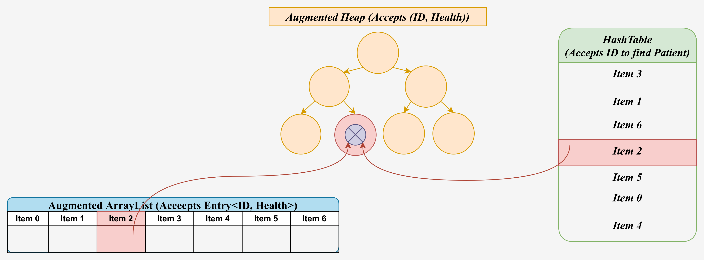

# Data Structure  
This project was designed by [**Dr. Hossein Esfandiari**](https://sites.google.com/view/hossein-esfandiari)
for the Data Structure course (Spring 2021).

## Description
The goal of this project is to develop a system that maintains and processes patients’
information. For each patient we have a unique patient ID which is a positive integer (between 0
and 10^9), and a health measure which is an integer (between -10^9 and 10^9). Design and
implement a data structure that supports the following queries:

  * **Add X Y**: This operation inserts a patient with patient ID X and health measure Y to the
data structure. This operation is called upon the arrival of a patient.

  * **Serve First**: This operation serves the patient in the data structure that arrived the
earliest, and removes her from the dataset. 

  * **Serve Sickest**: This operation serves the patient in the data structure that has the lowest
health measure and removes her from the dataset. 

  * **Update X Y**: This operation updates the health measure of the patient X to value Y.

The running time of each operation should be either **O(log(n)) in the worst case**, or **O(1) in
expectation**. Note that you are supposed to implement any data structure that you need
yourself. You are not allowed to use data structures from the standard library of your
programming language or from the internet.  
The input is a list of queries, with one query per line. Whenever a patient is served (either
through Serve First or Serve Sickest), write the patient’s ID followed by a space and the
patient's health measure at the serving time, and move to the next line.  
The queries are set such that the number of patients in the data structure is always less than or
equal to 10^6. However, the total number of patients that are inserted to the data structure and
served is not limited.  

* Hint 1: you need to use multiple data structures.  
* Hint 2: you do not need red-black tree.

## Implementation
* Multiple data structures have been used in this project which will be discussed:
    * Entry<ID, Health> regarding the Composition design pattern to ease the implementation of the queries.
    * A simple ArrayList which is used for implementing the Heap.
    * An augmented Array to handle the order of patients.
    * A Heap to take care of the sickest patient.
    * A Hash Table to provide patients' Entry in sufficient time complexity.  
  

* The overall workflow of the system as follows - O(log(n)) in the worst case, or O(1) in expectation:
  1. Client will enter the patients' <ID, Health> and Entry<ID, Health> will be created.
  2. The Entry will be added to the Heap. The add method in HeapPQ class is implemented in a way
  to return the added Entry - O(logn) worst case.
  3. The returned Entry will be added to the augmented Array - O(1) amortized.
  4. The returned Entry will be added to the Hash Table - O(1) in expectation.
  5. If Serve First or Serve Sickest is called, the Entry should be found using the Hash Table in O(1) in expectation.
  Then, it can be removed from all the data structures in O(log(n)) worst case.
  6. If Update is called, the Entry should be found using the Hash Table in O(1) in expectation.
  Then, the Entry can be updated in O(1) worst case.

* The overall Design of the system is also as follows:  

* Test case are provided in the Documents' folder of the repository.

